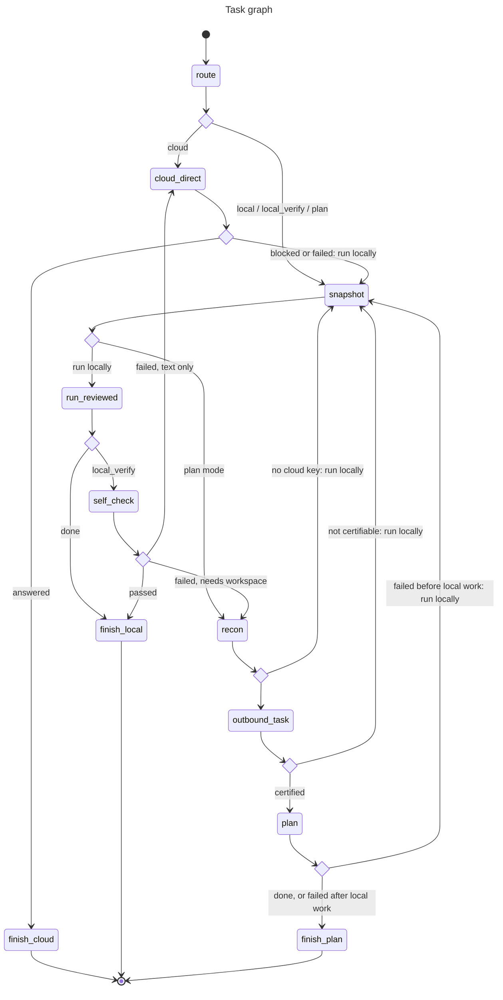
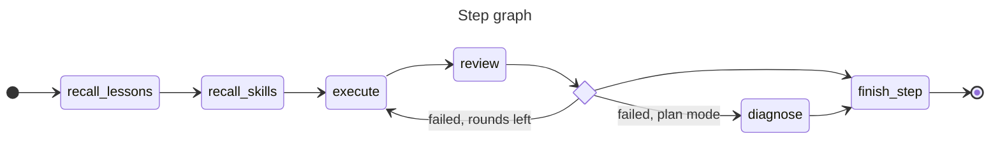

# Architecture

How a task moves through Hermie, which module owns what, and the invariants that keep local data local. The original design rationale is in [design.md](design.md); this page describes the code as it is.

## Request flow

`core.Hermie.run` does the following for every task:

1. `router.EntryRouter` runs three things in parallel: the privacy check on the task text (Presidio rules plus the judge's contextual question, a request of its own), one structured judge request per sample answering the three routing questions at once (task type, difficulty, does it need the workspace; `ROUTING_QUESTIONS`, `JUDGE_BATCH`), and the RouteLLM complexity score.
2. `policy.decide()` turns those signals into a route. It is a pure function with no I/O, so routing changes are made there and tested directly in `tests/test_policy_privacy.py`.
3. The task graph (`graph.py`, on pydantic-graph) runs the task. `snapshot` takes the pre-task snapshot; `run_reviewed` runs the step graph (`execute` → `review` → fix, up to `VERIFY_ROUNDS`); `self_check` asks the judge whether a local_verify result is good enough; `recon` → `outbound_task` → `plan` is plan mode; `cloud_direct` is the cloud route; the `finish_*` nodes build the result. Every cloud failure is a `fallback` edge back to `snapshot`, so the task finishes locally and keeps what the executor already produced. The planner's `delegate` tool runs the same step graph, plus a `diagnose` node on failure.
4. The audit log gets a line: route, signals, backend, outbound count, and the SHA-256 of the input. Never the input. `trajectories.jsonl` gets one line too: the nodes the task went through with their durations and decisions, the routing signals and counters. Node bodies only pass counts, flags and probabilities into it, never text.

| Route | Nodes | Who runs |
|---|---|---|
| `local` | `snapshot`, `run_reviewed`, `finish_local` | local executor + local review loop |
| `local_verify` | the same, then `self_check`; escalates to `recon` (plan mode) or `cloud_direct` if the review or the self-check fails | executor + review loop, then a judge self-check |
| `cloud` | `cloud_direct`, `finish_cloud` | cloud model alone, for tasks that need no workspace and carry no private data |
| `plan` | `snapshot`, `recon`, `outbound_task`, `plan`, `finish_plan` | workspace recon, then the cloud planner (`set_plan`, `delegate(step, acceptance)`) driving the local executor step by step |

Any yes-vote on "needs the workspace" is treated as "do it locally". Any cloud failure falls back to local and keeps the partial local results.

`hermie --graph` prints both graphs from the code:

## Modules

**`agents.py`** builds the four agents on Pydantic AI. `build_executor` is the local Ollama model with tools that all go through the sandbox; its structured output separates `report` (may go to the cloud after certification) from `answer` (stays local). `build_planner` is the cloud model with only `set_plan` and `delegate`; it receives a `run_step` callback from core. `build_reviewer` is a local model that returns a `Review`. `build_cloud_agent` is the cloud model for the direct route. `validate_report` is the output validator: it enforces "verify before done" deterministically and re-certifies every text field of the report, aliasing sensitive paths as `file#n`.

**`privacy.py`** is the gate. `certify()` runs rules (regexes for Chinese phone and ID formats, cards, emails, IPs, and `SECRET_PATTERNS` for API keys, cloud credentials, private-key blocks, JWTs and `password=` assignments), then Presidio NER, then the judge's contextual check. It returns a `CleanText`, the only type the cloud agents accept. `trusted_template()` wraps hard-coded constants and nothing else.

**`capabilities.py`** holds the runtime guards. `OutboundGuard` runs before every cloud request: every non-model-generated message part must already be in `TaskState.certified` or pass `certify()` on the spot, otherwise `OutboundBlockedError`. `CommandGuard` rates shell commands (rules first, judge fallback; interpreter invocations with inline code always go to the judge) and asks for approval through `EventBus.approver` in default mode. `TaintTracker` runs Presidio on every tool result synchronously and schedules the judge's contextual check and stuck detection as background tasks; anything that depends on the result calls `settle_checks()` first. Tool budgets live here too.

**`sandbox.py`** writes a Seatbelt profile into the data dir at startup. Shell commands and file operations (delegated to `_fsops.py` under `python -I`) both run under `sandbox-exec`. The environment passed in is a fixed allowlist. `_fsops._resolve` additionally refuses any path whose realpath leaves the workspace; in `RunMode.NO_SANDBOX` that check is the only boundary left. Files and directories the user attaches to a task (dropped into the input box) are readable, never writable, for that task only (`Sandbox.grant_read`); credential and `.env` files inside them stay denied, and `/`, the home directory and its ancestors are never granted.

**`snapshot.py`** takes a snapshot before every task and before every planner delegation. Git workspaces get a commit under `refs/hermie/snapshots/*` (the user's index and HEAD are untouched); other workspaces get an APFS clone. `diff()` feeds the reviewer and the TUI "Changes" tab. `rollback()` with no id returns to the latest task snapshot, not the latest step.

**`web.py`** is the executor's checked network path. `web_fetch` and `web_search` run in the controller process. The sandbox itself is online as well (dependency installs, clones); network commands such as `curl` or `pip install` are rated high risk and need approval in default mode. The URL or query is outbound content: it is percent-decoded, certified, logged to `outbound.jsonl`, and once the task is `exposed` (sensitive task text or a tainted tool output) also checked by `web.smuggling_risk` and a judge question. Results are prefixed with a "reference only" note and excluded from taint.

**`recon.py`** produces a deterministic workspace overview (sandboxed directory listing plus one probe command) for the planner. **`project_doc.py`** manages `AGENT.md` in the workspace: loaded into every executor prompt, appended to the planner's task through the same certify/redact path, progress entries written deterministically after every task, lessons written by a local model after a review-then-fix success (and for problems the reviewer raised twice without a fix). The planner receives AGENT.md without its Lessons section.

**`memory.py`** is the lesson memory: `LessonStore` over `data_dir/lessons.jsonl` (lesson text, tags, an embedding of the lesson and of the task that produced it, never the task text) and `Embedder` over Ollama's `/api/embed`, falling back to word overlap. The step graph's `recall_lessons` node puts the most relevant lessons in front of the executor prompt; same-project lessons always qualify, others need `LESSONS_MIN_SIM`. `sync_doc` imports hand-written AGENT.md lessons and disables deleted ones.

**`skills.py`** is the skill library: `SkillStore` over `data_dir/skills/*.md` (front matter `id`, `title`, `status`; sections When to use / Steps / Verify) plus `index.jsonl` (counters, embeddings, last seen mtime, so user edits are noticed and Hermie's own writes are not). The step graph's `review` node keeps passing runs with enough tool calls in memory (`TaskState.skill_episodes`); after the task, `Hermie._skills_after_task` distills at most two of them with the local model, drops any playbook that fails `gate.check`, never distills for a task that touched sensitive data, and adds a candidate or confirms (activates) a similar one. `recall_skills` injects active skills similar to the step; skills that keep not helping retire themselves. The planner never sees skills.

**`calibrate.py`** reads `trajectories.jsonl`, labels each finished task with the routes that would have been right, replays the pure `policy.decide` over a threshold grid and reports the best configuration (`hermie --calibrate`, `/calibrate`). It writes `.env` only through `apply()`, only for `--apply`, only above `CALIBRATE_MIN_TASKS` labelled tasks. The eval scripts' `sweep` uses the same code.

**`events.py`**: the core never touches the UI. It emits `Event` dataclasses on an `EventBus`; `ApprovalRequest` is the only thing that flows back. `tui/app.py` subscribes and re-posts as Textual messages; `cli.py --json` prints them.

**`session.py`**: `Session` lives across tasks (executor history, session-wide approvals, usage stats). `TaskState` is per task and is the `deps` object for every agent.

**`tui/`**: Textual app. Slash commands are declared once in `tui/commands.py`; the autocomplete popup and `/help` are generated from that table. **`perf.py`** samples CPU, memory and GPU utilization for the Performance tab. **`voice.py`** holds the recorder, the mlx-whisper transcriber and the `say` speaker; only the TUI touches it.

## The self-verification loop

After the executor claims `done`, the step graph (`graph.py`: `execute` → `review`) hands a local reviewer the task, the acceptance criteria, the workspace diff since the task-start snapshot and the recent command outputs. On failure the problems are appended to the prompt and the executor re-runs, up to `VERIFY_ROUNDS`. Reviewer errors fail open (this is a quality mechanism, not a privacy one). Before any of that, `validate_report` bounces a `done` that wrote files without a verification step.

In plan mode each delegated step also produces a `diagnosis`: a local model rewrites the concrete failure into a data-free description of the cause, which is certified before it leaves. The outbound report degrades step by step (with review and diagnosis, with review, bare, status only) until it certifies.

## Privacy invariants

These hold everywhere in the codebase. Changing any of them is a design discussion, not a refactor.

- `CleanText` is constructed only in `privacy.py`. `trusted_template()` is for hard-coded constants; user-derived text never goes through it.
- Any exception in Presidio or the judge means sensitive. Any cloud failure falls back to local.
- The planner receives only: redacted or abstracted task text, the workspace overview and project doc through the same path, and `format_report()` output (report, local review verdict, certified diagnosis, budget line). Never `answer`, never file contents, never the diff. `restore_local()` maps placeholders and `file#n` aliases back before anything reaches the executor.
- Review problems, suggestions, diagnoses and lessons are produced by local models only. `ModelFactory.reviewer()` and `models.compressor()` (history compression and abstraction) stay local.
- The audit log stores the input hash only. `outbound.jsonl` gets exactly what was certified.
- The sandbox environment is a fixed allowlist. `os.environ` is never passed through. Credential files in the workspace are unreadable (`SANDBOX_DENY_NAMES`); `.env` is deliberately readable because build commands need it, and its keys are caught at the gate by the secret recognizer.
- RouteLLM is loaded through `transformers` directly (`complexity.py`).

## Known quirks

- The Chinese spaCy model labels Latin words and JSON punctuation as PERSON. `privacy._plausible` drops NER hits without CJK characters. Extend that filter for new false-positive patterns rather than lowering `PRESIDIO_THRESHOLD`.
- The "needs workspace" judge question is worded with concrete examples on purpose; abstract wording made a 27B judge say "no" to "build an app".
- Ollama's OpenAI-compatible endpoint turns thinking off via `extra_body={"reasoning_effort": "none"}`; the judge uses the native `/api/chat` with `think: false`.
- The first RouteLLM call imports torch (about 45 s). `Hermie.warm_up()` does it in the main thread before Textual starts; loading it inside a Textual worker breaks tqdm's multiprocessing lock, which is why progress bars are disabled in `config.py`. mlx-whisper has the same problem, handled by `voice.prime_tqdm_lock()`.
- `PYDANTIC_AI_NO_BANNER=1` is set in `config.py`; the banner corrupts the TUI.
- The sandbox allows writes to the per-user temp and cache dirs so xcrun, clang and swiftc can write caches. pytest's `tmp_path` lives there, so tests must never use it as an "outside the sandbox" target.
- `#Preview` macros fail under the sandbox (Xcode's plugin server tries to nest its own sandbox). Not fixable without loosening Seatbelt.
- A `RichLog` inside an inactive Textual `TabPane` buffers writes until first shown; TUI tests activate the tab before asserting.
